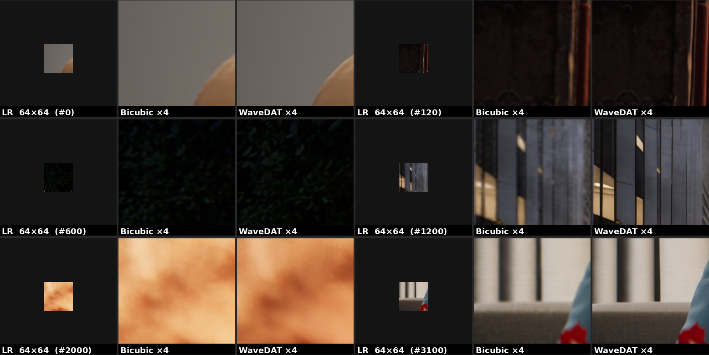

# Super Resolution in Video Games

## Members
1. Le Thi An (Student ID: 314540018)
2. Ngo Van Anh (Student ID: 314540068)
3. Lim Hao Teng (Student ID: 314540019)

---

## Introduction

Image Super-Resolution (SR) reconstructs a high-resolution (HR) image from a low-resolution (LR) input. In the "Super Resolution in Video Games" challenge, the task is to upscale game screenshots by 4×, converting 64×64 LR tiles into 256×256 HR outputs while retaining sharp edges and fine details. The training set contains paired LR-HR images at 270×480 (LR) and 1080×1920 (HR). At inference time, LR patches are cropped to 64×64 and HR targets are 256×256. PSNR is used for evaluation.

Our model, **WaveDAT**, extends the Dual Aggregation Transformer (DAT) with three targeted contributions: Multi-Scale Windows (MSW), Wavelet-based Dual Feature Extraction (WaveDFE), and Frequency-Guided Channel Attention (FGCA).

---

## Key Contributions

### 1. Multi-Scale Windows (MSW)
Each Residual Group contains three scale stages using window sizes 8×8, 16×16, and 32×32. This gives the model a hierarchical receptive field, capturing both fine UI details and large background textures within a single group.

### 2. WaveDFE — Wavelet-based Dual Feature Extraction
WaveDFE replaces the depthwise convolution (DWConv) in the Adaptive Integration Module (AIM) of each spatial attention block. It extracts frequency-aware local features via:
- **Channel branch**: 1×1 Conv applied to the input features.
- **Wavelet branch**: Haar DWT decomposes input into LL/LH/HL/HH subbands → 3×3 Conv in wavelet domain → bilinear upsample back to spatial size → GroupNorm.
- A sigmoid gate (derived from the channel branch) weights the wavelet branch before adding to the channel output.

### 3. FGCA — Frequency-Guided Channel Attention
FGCA replaces the average-pool SE gate before each spatial attention block (DSTB). It computes two DWT-based descriptors from the input:
- `ll_desc`: mean of the LL (low-frequency) subband.
- `hf_desc`: mean energy of LH+HL+HH (high-frequency) subbands.

These are concatenated and passed through an MLP to produce a per-channel attention gate, specialising channels in different frequency bands.

---

## Architecture Summary

| Component | Details |
|---|---|
| Base model | DAT (Dual Aggregation Transformer) |
| Scale | ×4 |
| Embed dim | 180 |
| Residual Groups | 6 |
| Blocks per group | 6 (3× DSTB + 3× DCTB, alternating) |
| Window sizes (MSW) | 8×8 → 16×16 → 32×32 per group |
| Split size | [8, 8] |
| Num heads | 6 per layer |
| AIM local branch | WaveDFE (Haar DWT + bilinear upsample) |
| Channel attention | FGCA (DWT freq descriptors) |
| DCTB | Unchanged from original DAT |
| Upsampler | PixelShuffle |

**Parameter count**: ~29.2M  
**Warm-start**: MSW-DAT checkpoint (82.8% keys match; WaveDFE and FGCA layers are randomly initialised with near-identity bias to avoid disrupting the warm-start).

---

## Installation

```bash
conda env create -f environment.yml
conda activate final
```

---

## Project Structure

```
final_proj/
├── basicsr/
│   ├── archs/
│   │   ├── dat_arch.py          # Original DAT (used as base)
│   │   └── wavedat_arch.py      # WaveDAT: WaveDFE + FGCA + MSW
│   ├── models/
│   │   └── dat_model.py
│   └── train.py / test.py
│
├── datasets/
│   ├── train/                   # Cropped LR (64×64) / HR (256×256) pairs
│   ├── val/
│   └── process.py               # Crop/prepare LR-HR patches
│
├── videogames_data/
│   ├── train/                   # Full LR and HR training images
│   └── test/                    # Test LR images
│
├── experiments/
│   └── WaveDAT/models/          # WaveDAT checkpoints
│
├── options/
│   ├── Train/train_WaveDAT.yml  # WaveDAT training config
│   └── Test/test_wavedat_x4.yml # WaveDAT inference config
│
├── scripts/
│   ├── train.sh                 # Training command
│   └── test.sh                  # Inference command
│
├── environment.yml
└── gen.py                       # Convert predictions to submission CSV
```

---

## Download Dataset

Download at [Video Games — Kaggle](https://www.kaggle.com/competitions/super-resolution-in-video-games/data).

---

## Data Preparation

Generate 64×64 LR patches and matching 256×256 HR patches:

```bash
python datasets/process.py
```

This script:
1. Reads paired LR-HR images from `videogames_data/train/`.
2. Extracts a random 64×64 patch from the LR image.
3. Extracts the matching 256×256 patch from the HR image.
4. Saves to `datasets/train/` and `datasets/val/`.

---

## Download Pretrained Weights

Download the official [DAT ×4 pretrained weights](https://drive.google.com/file/d/1pEhXmg--IWHaZOwHUFdh7TEJqt2qeuYg/view) and place in `experiments/`.

WaveDAT is warm-started from an MSW-DAT checkpoint. Specify the path in `options/Train/train_WaveDAT.yml` under `path.pretrain_network_g`.

---

## Training

```bash
PYTHONPATH=$(pwd) python -m torch.distributed.launch \
    --nproc_per_node=1 --master_port=4321 \
    basicsr/train.py -opt options/Train/train_WaveDAT.yml --launcher pytorch
```

Key training settings (from `train_WaveDAT.yml`):

| Setting | Value                                                   |
|---|---------------------------------------------------------|
| Loss | Charbonnier (`eps=1e-9`)                                |
| Optimizer | Adam                                                    |
| Learning rate | 5e-5 (low; warm-started from converged MSW-DAT)         |
| LR schedule | MultiStepLR, milestones [100k, 200k, 250k, 350k], γ=0.5 |
| Total iterations | 500,000                                                 |
| Batch size per GPU | 2                                                       |
| GT patch size | 256×256                                                 |
| Augmentation | Random hflip + rotation                                 |
| `strict_load_g` | False (WaveDFE/FGCA layers not in MSW-DAT checkpoint)   |

---

## Inference

```bash
PYTHONPATH=$(pwd) python basicsr/test.py -opt options/Test/test_wavedat_x4.yml
```

Then generate the submission CSV:

```bash
python gen.py -f ./results/WaveDAT/visualization/Single -s ./results/WaveDAT.csv
```

The inference config uses TTA (`use_tta: True`) and loads the checkpoint specified in `options/Test/test_wavedat_x4.yml`.

---

## Performance
<p align="center">
  
</p>
<p align="center"><strong>Figure 1:</strong> Qualitative comparison: LR 64×64 | Bicubic ×4 | WaveDAT ×4.</p>


<p align="center">
  
</p>
<p align="center"><strong>Figure 2:</strong> PSNR on the Kaggle test leaderboard.</p>

| Model | PSNR       |
|---|------------|
| Previous best | 33.800     |
| **WaveDAT (ours)** | **34.380** |

